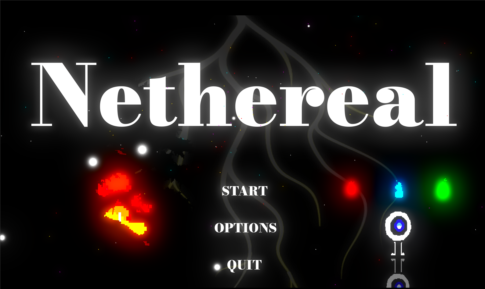

# Nethereal-Godot-

This is a game that I have been working on using the Godot engine. Though it's still in its infancy, I want to keep working on it in the future. The game's idea is that you've woken up in an infinite nothingness with no memory of your past.You must use your soul powers to get away from the darkness before it consumes you, dodging obstacles on your path. This game was inspired by the recently released game Chained Together.

Here are some images of the game so far:

